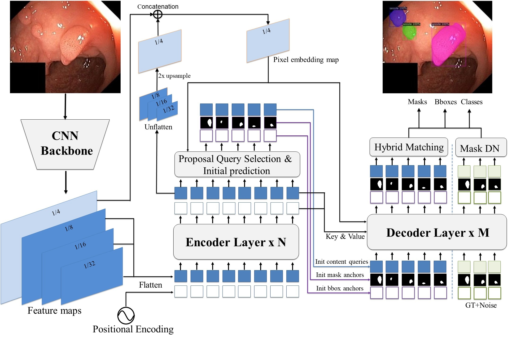

# DYNAFormer
DynAMFormer: Enhancing Transformer Segmentation with Dynamic Anchor Mask for Medical Imaging

##  Introduction

This repository contains the PyTorch implementation of DYNAFormer, Enhancing Transformer Segmentation with Dynamic Anchor Mask for Medical Imaging.
DYNAFormer use an anchor mask-guided mechanism that enhances segmentation by using each positional query as an anchor mask, instead of traditional anchor boxes in methods like DINO and MaskDINO, enabling adaptive focus on relevant areas with pixel-level precision rather than coarse bounding box regions. This approach allows more precise, adaptive feature learning through dynamic refinement across decoder layers.



##  Install dependencies

Dependent libraries
* torch
* torchvision 
* opencv
* ninja
* fvcore
* iopath

Install detectron2 and PISeg.

```bask
# Under your working directory
# Install Detectron2
cd ./detectron2
!python setup.py build develop
cd ..

#Install requirements for piseg
cd ./piseg
!pip install -r requirements.txt
cd ..

cd ./piseg/piseg/modeling/pixel_decoder/ops
!sh make.sh
```
